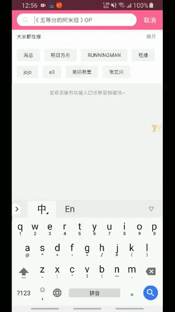
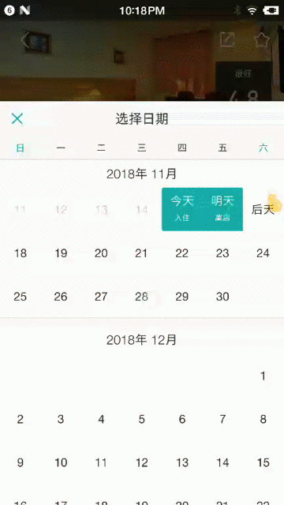
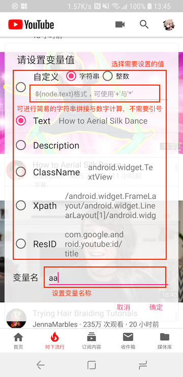
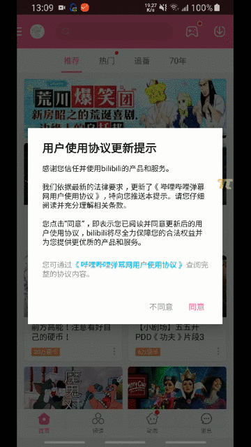

## 常用控件操作方法示例

#### 点击操作

1. 点击 

   > 会根据实际点击的黄点进行点击

2. 长按 

​	**对于锤子用户，需要关闭设备的大爆炸功能，否则无法正常使用长按**

3. 快速点击（暂无截图）

   > Soloπ执行完一步操作后，默认会等待页面停止变化，对于一些需要快速点击的控件，Soloπ提供快速点击功能。

4. 重复点击 

   > 快速对用户点击位置进行重复点击

#### 输入操作

1. 输入 

2. 输入并搜索 

#### 滑动操作

1. 上滑 

   > 根据控件高度百分比进行滑动

2. 左右滑 

   > 从点击的位置开始滑动，按照控件宽度百分比滑动

#### 断言操作

1. 断言 

   > 支持文字比较与数字大小判断

2. 等待控件出现（暂无截图）

   > Soloπ会等待目标控件出现，可以配置等待超时时间，单位ms，默认等待超时10s，当控件出现时，Soloπ停止等待。当等待超过指定的超时时间，Soloπ会中断操作。

3. 设置变量 

   

   #### 附加操作

   具体介绍可见全局操作中关于附加操作的介绍

## 常用全局操作方法示例

> 触发全局操作，需要点击屏幕右侧的Soloπ图标（下图）
>

#### 常用操作

1. 返回 

   > 等同于点击back键

2. 处理弹窗 

   > Soloπ会检测目前界面中是否包含弹窗， 并自动处理弹窗，对与大多数系统的权限弹窗，Soloπ在运行过程中能够自动处理， 不需要手动点击处理弹窗

3. 截图 

#### 应用操作

1. 回到首页 

2. Scheme跳转 

3. 结束进程 

#### 滑动操作

1. 全局滑动 

#### 互联操作

1. 安装应用（仅一机多控） 

   > Soloπ可以自动安装应用，由于OPPO、Vivo设备在安装时需要输入密码，需要手动在设置中配置设备的安装密码，以便Soloπ能够进行自动安装，密码默认为`a1234567`

2. 下载文件（仅一机多控） 

   > Soloπ在文件下载完毕后会通知系统更新相册，可用于扫码等场景

#### 设备操作

#### 额外操作

#### 流程控制

1. 暂停（仅一机多控） 

   > 主机暂停操作监控，点击葫芦图标后可恢复监控

2. 结束

   > 停止录制或回放