## 介绍

编辑Soloπ在录制回放模式下录制的自动化用例，支持添加IF、WHILE逻辑语句，增强在一些复杂场景下的可用性。

## 准备工作

1. 进入录制回放页面，界面如下： 
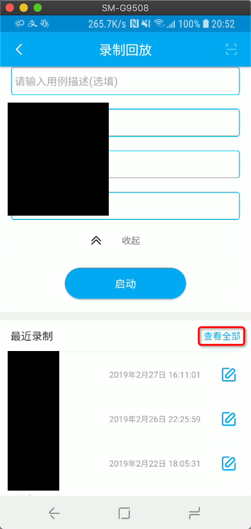

2. 点击查看全部，进入用例列表页面，长按需要编辑的用例选择编辑用例并执行。 
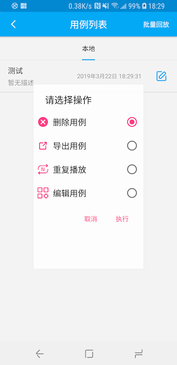

## 用例编辑

### 编辑页

   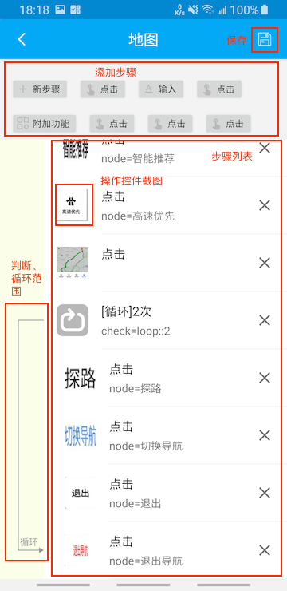

* 添加步骤：包含创建新步骤与复用已有步骤，点击第一个tag为创建新步骤（当前只支持创建全局操作，控件操作暂不支持），之后的为该用例已有的步骤，点击后会添加步骤到步骤列表的末尾。
* 步骤列表：当前编辑用例的操作步骤列表，可以修改、删除、拖动，支持IF、WHILE操作。
* 左侧框图：表示循环与判断的执行范围，当满足循环/判断条件时，用例会执行该范围内部的步骤。
* 保存： 保存编辑的用例，**编辑完后一定要保存才能生效**，**编辑完后一定要保存才能生效**，**编辑完后一定要保存才能生效**。

### 编辑步骤信息

可以通过点击需要编辑的步骤来修改步骤的节点与操作相关信息。

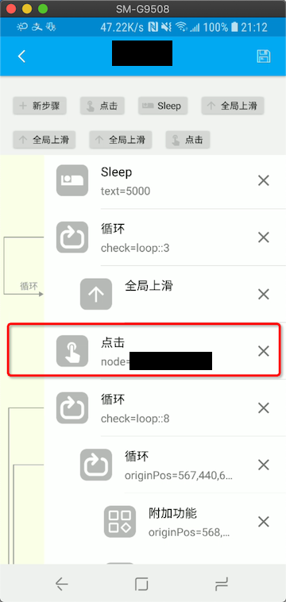

#### 控件信息编辑

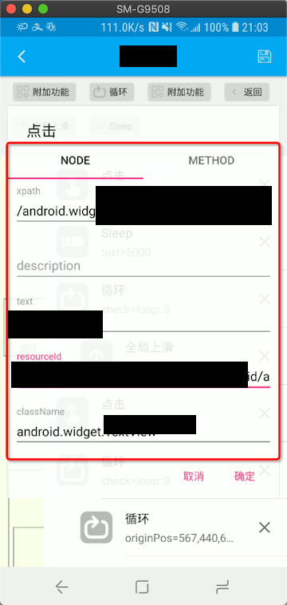

图中红色框图区域（NODE tab下）为可编辑的节点信息列表（可拖动），当需要修改待操作的控件信息时，需要同时修改节点的`xpath`、`className`、`resourceId`、`text`和`description`信息，如果不了解相关信息可以设置为空，但className信息需要保持一致，推荐使用TextView的文本信息用来操作。

#### 操作信息编辑

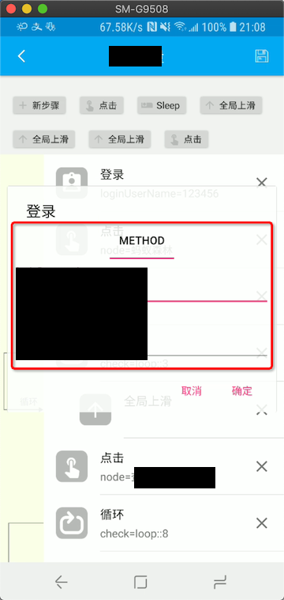

图中红框区域（METHOD tab下）为可编辑的方法信息列表，不同的方法使用到的参数各有差异，通常在录制用例时输入的内容在`text`字段下，其他方法的参数可以参照字段名称进行理解。

#### 删除步骤

可以点击步骤右侧的"X"按钮删除当前步骤。

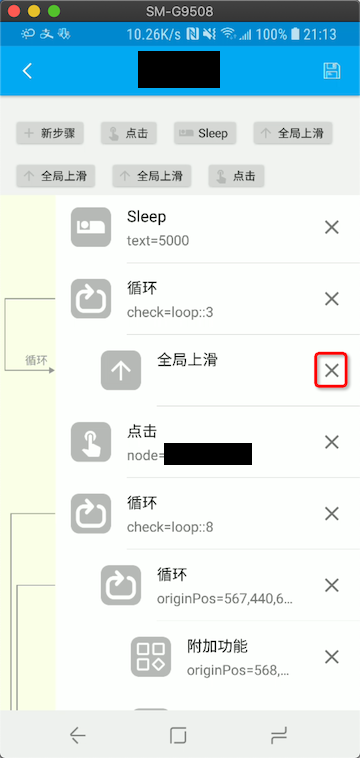

#### 移动步骤

可以长按步骤进行拖动，修改顺序。

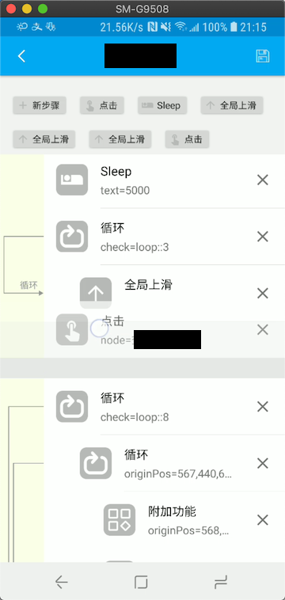

#### 添加步骤

支持创建新步骤与复用当前步骤，新步骤会添加到当前步骤列表的末尾。

##### 创建新步骤

可以添加新步骤，具体操作流程与一机多控和录制回放的操作方式相同。

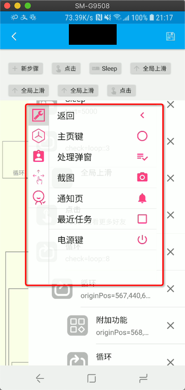

##### 复用步骤

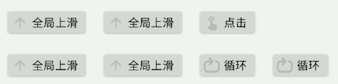

点击tab即可复用对应操作。

## 逻辑操作

当前支持的逻辑操作有IF操作和WHILE操作。这两种操作可以由普通操作转化而来，也可以单独进行创建。

#### 转化操作

对于一步非逻辑操作（不属于`判断`、`循环`、`继续循环`和`中断循环`这四项功能），可以通过左滑操作转化为IF、WHILE操作。

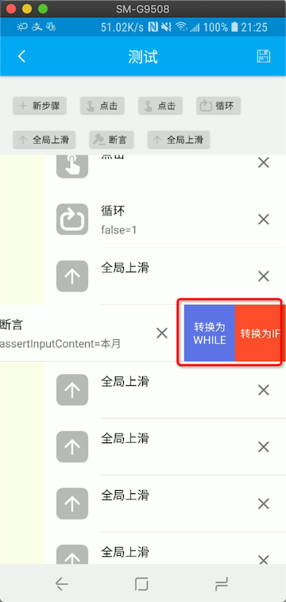

转化后原步骤会消失，变成IF/WHILE操作，默认执行范围为之后的一条步骤。

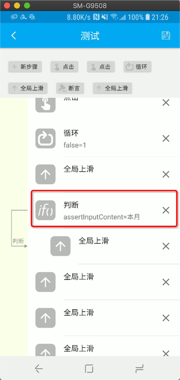

#### 全新创建

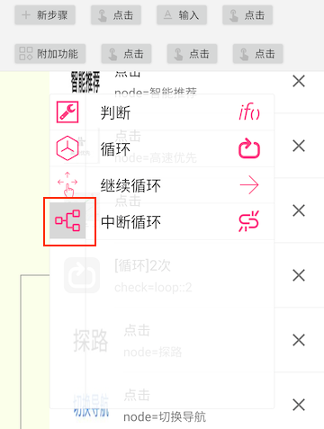

点击新步骤，选择第四项逻辑操作分组（上图中红框部分），有`判断`、`循环`、`继续循环`和`中断循环`四个功能菜单，选择对应功能即可在用例末尾创建对应的功能。

创建`循环`操作时，可以选择是通过次数循环还是指令循环

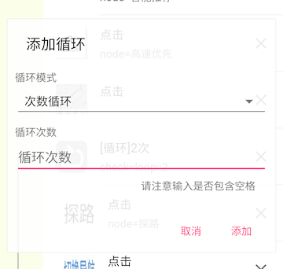

### 逻辑操作编辑

IF和WHILE操作有两个公用的参数`check`和`边界`

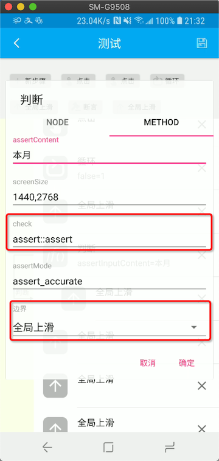

#### 边界字段

边界为逻辑操作的范围，可选范围为逻辑控制操作之后的操作步骤。

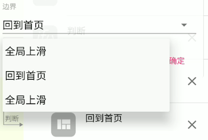

#### check字段

##### 表达式

check字段可以为一个包含判断符号的表达式，支持字符串对比与数字（整数）对比，这两种对比的格式存在差异。格式类似于`${charge} + ${pre} > 4`，其中`${a}`符号为获取之前通过LET方法设置的`a`变量，Soloπ提供`.length`操作，如`${a.length}`，即获取字符串`a`的长度。

​	对于字符串对比的表达式，支持通过`+`来连接字符串；对于数字对比的表达式，则支持通过`+`、`*`进行运算。

###### 字符串对比

支持的判断符号有：

* `!=`： 判断左右两侧字符串不相等
* `=` ： 判断左右两侧字符串相等

###### 数字对比

支持的判断符号有：

* `>`  ：大于
* `>=`：大于等于
* `<`  ：小于
* `<=`：小于等于
* `==`：等于
* `<>`：不等于

##### assert方法

从普通非逻辑步骤转化的IF、WHILE操作的check字段包含前缀`assert::`，之后字段为实际的assert方法，请不要对该字段进行修改，以免用例无法正常执行。

##### 其他格式

* while方法支持`loop::n`格式的check字段，表示循环执行n次。