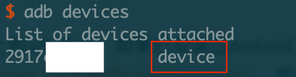
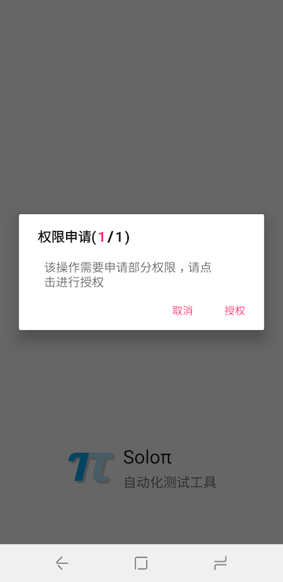
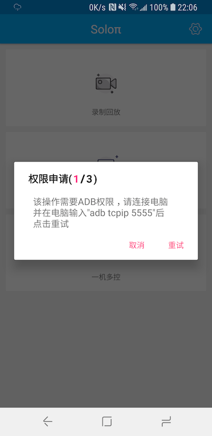
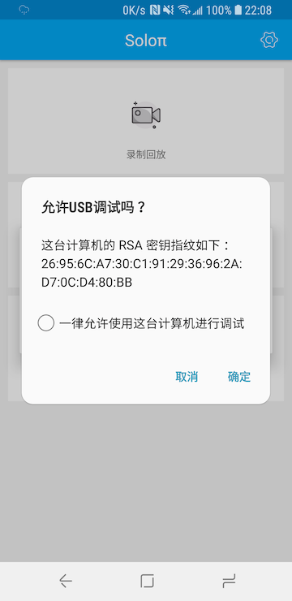
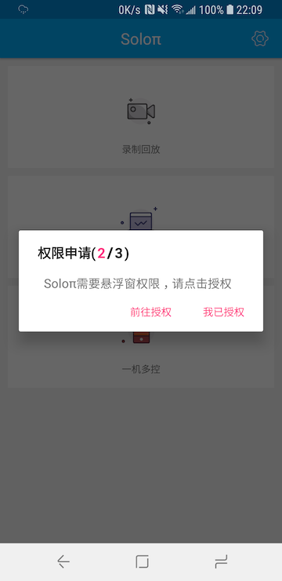
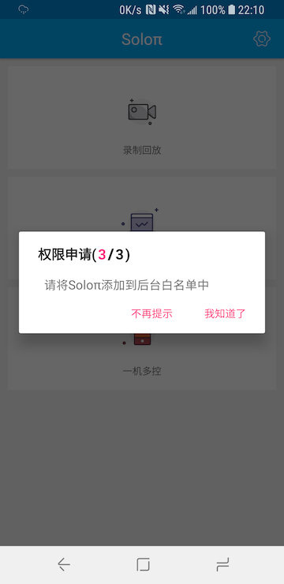
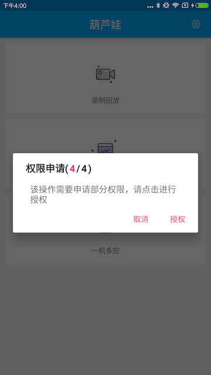
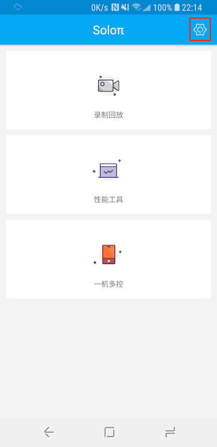
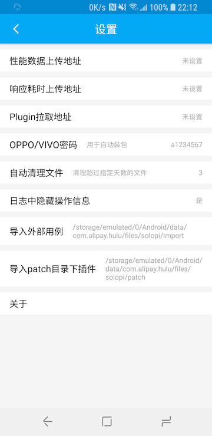

# 初次使用

## 环境准备

- 需要开启Android设备的`设置 -> 开发者选项 -> USB调试`功能。如果设置中不包含开发者选项，请参考<https://developer.android.com/studio/debug/dev-options?hl=zh-cn>中的`启用开发者选项和调试`进行开启。

  * **对于VIVO设备，如果在开发者选项中包含“USB安全操作”，需要手动进行开启，否则录制回放与一机多控功能可能会无法正常操作**
* **对于小米设备，需要开启开发者选项中的`USB安装`与`USB调试（安全设置）`，否则录制回放与一机多控功能会无法正常操作；此外，还需要手动开启Soloπ应用权限中的`后台弹出界面`选项，否则无法正常使用**
  * **对于魅族设备，如果待测应用属于支付、金融类应用，需要在手机管家中关闭安全支付功能，否则录制回放与一机多控功能可能会无法正常操作**
* **对于华为设备，需要开启开发者选项中的 `"仅充电"模式下允许ADB调试`，否则断开USB线后会提示adb调试中断**
  * **对于OPPO设备，系统会10分钟自动断开USB调试，导致Soloπ不可用。如果想要保持调试稳定，需要将设备连接到电脑**

- Soloπ的初始化需要电脑上的adb命令，如果已安装过Android Studio并配置好SDK路径，需要在系统环境变量中为PATH变量添加值`${Android SDK的路径}/platform-tools/`，如果未安装过Android Studio，可以从<https://developer.android.com/studio/> 下载适合自己系统版本的Android Studio，并按照安装流程配置好SDK，再按照上面的步骤完成adb环境的配置。对于Window系统，可能需要安装对应设备的驱动才能连接。

- adb环境配置完毕后，需要将您的Android设备连接到电脑上，通过`adb devices`命令来查看Android设备是否已经连接了电脑。当显示下图中红框所标注的`devices`时，说明您的设备已经与电脑建立连接。

   

- Soloπ依赖设备远程adb来执行设备操作与待测应用信息获取，所以需要在每次设备重启后连接电脑并执行`adb tcpip 5555`来开启设备远程adb调试端口。

   > **注意：由于Soloπ需要使用adb的远程调试能力，而目前android设备并不支持通过wifi连接多台设备进行调试，所以在Soloπ的使用过程中，只能通过USB数据线有线连接进行调试。**

## 权限申请

第一次启动Soloπ时，会申请读写权限，获取读写权限后，Soloπ会将运行过程中获取到的各项数据存储到`/sdcard/solopi`目录下，**如果不授予读写权限，Soloπ会使用`/sdcard/Android/data/com.alipay.hulu/files/solopi`目录作为存储位置。之后所有涉及到使用`/sdcard/solopi`目录的操作都需要替换为该目录**

   

Soloπ第一次使用各项功能时，会提示该功能所需要的各项权限，如下图所示：

   

默认会申请以下权限：

1. adb权限

   > 请勾选“永远允许这台电脑”或类似其他文案，并选择确定。

   

2. 悬浮窗权限

   > 请点击前往授权，授予Soloπ显示悬浮窗的权限，然后返回该界面点击我已授权。Soloπ在运行过程中需要悬浮窗来展示实时数据或者通过操作悬浮窗来执行操作。

   

* **对于OPPO与Vivo手机、Soloπ可能无法正确判断悬浮窗是否能够正常显示，如果点击前往授权没有反应，请尝试前往设备的手机管家，在应用管理中授予Soloπ悬浮窗权限**

* **对于锤子手机，Soloπ在显示悬浮窗时系统会再次弹出是否允许Soloπ显示悬浮窗，请选择允许**

3. 添加到后台白名单

   > Soloπ需要长时间在后台运行以监控应用的性能或者执行操作，为防止Android系统将Soloπ进程回收，需要用户手动将Soloπ添加到后台白名单中。可以选择不再提示，之后Soloπ将不再对添加白名单进行提示。

   

4. 动态权限申请

   > 对于一机多控，Soloπ需要额外申请相机、录制屏幕权限，用于主从机的扫描连接和响应耗时计算。

   

## 相关配置

   > 请点击Soloπ主页面右上角的设置图标进入

   

### 设置页主页

   

- 性能数据上传地址：Soloπ通过一机多控、录制回放或者性能工具录制的性能数据上传地址。
- 响应耗时上传地址：Soloπ通过一机多控、录制回放或者性能工具录制的页面响应耗时上传地址。
- Plugin拉取地址：Soloπ拉取额外插件的地址，如果需要使用响应耗时与图像查找功能，需要配置为可用的地址。**注意：请将Plugin拉取地址设置为`https://raw.githubusercontent.com/soloPi/SoloPi/master/<abi>.json`，否则Soloπ的一些功能将无法使用**
- OPPO/VIVO密码： Soloπ在一机多控功能中支持自动应用安装，对于OPPO与VIVO设备，其安装时需要输入密码才能进行安装。默认情况下，Soloπ会使用`a1234567`作为安装时输入的密码，点击可进行修改。
- 自动清理文件：Soloπ会自动清理已下载文件中修改时间超过配置天数的文件，默认配置为`3`天，点击可进行修改，配置为`-1`表示不进行删除。
- 日志中隐藏操作信息：开启后会隐藏Soloπ日志中的控件信息。
- 导入外部用例：Soloπ会从`/sdcard/solopi/import`文件夹导入json格式的用例，导入完毕后会将原始文件删除。
- 关于：Soloπ的相关信息，包含Soloπ版本信息、联系方式与版权信息。

