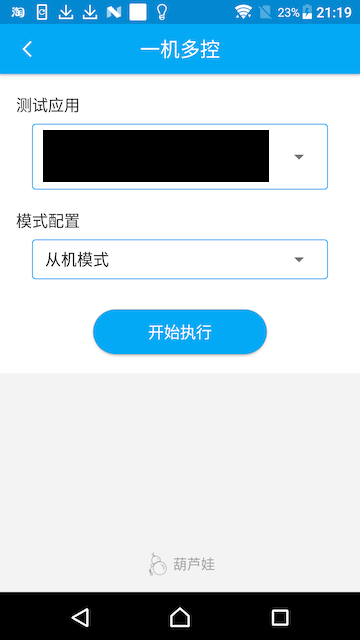
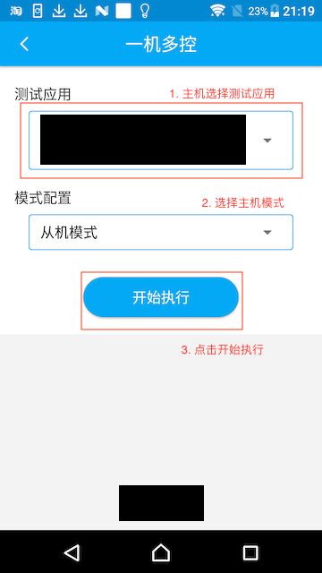
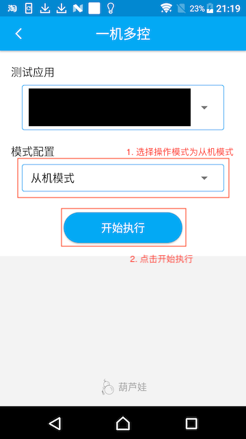
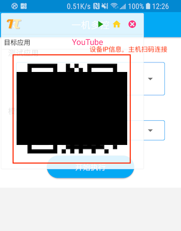
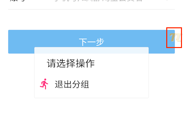

# 一机多控

## 介绍

对用户在主机上的操作进行录制，发送给多台从机进行批量回放，支持批量安装、显示设备信息等额外功能。

## 准备工作

在点击一机多控图标时，Soloπ会申请adb、悬浮窗、后台白名单、文件读写权限，请参考[第一次使用](FirstUse)

## 操作

打开Soloπ，进入一机多控页面，界面如下：

   

### 主机模式

1. 选择待测应用，模式配置为主机模式，点击开始执行。

   

   > Soloπ会提示开启辅助功能，需要用户点击前往开启进行手动开启，如果遇到辅助功能已开启的情况，需要用户现将辅助功能关闭后，再进行开启，如果始终无法通过校验，请尝试重启设备。

2. Soloπ会弹出操作悬浮窗，并自动跳转到被测应用的首页

   

   > 如果Soloπ未能通过android.intent.category.LAUNCHER解析出被测应用的启动页，跳转会失败
   >
   > 需要先扫描从机二维码，再进行连接，扫描过的设备会进入未连接设备区，点击连接后会尝试连接这些设备

3. 在悬浮窗中点击开始按钮，进入主机操作状态

   

4. 操作过程中，Soloπ会对用户的操作进行拦截，高亮当前点击的控件，并弹出操作选择框。

   

   > 如果显示的红框与期望操作的控件不符，可以考虑在全局操作中使用切换模式功能，切换到 H5增强模式 进行查找
   >
   > 控件操作的具体内容可以查看[控件操作](Actions#常用控件操作方法示例)
   >
   > 当Soloπ图标为红色时，表示正在执行操作，执行完成后会变为黄色，请耐心等待

5. 除了上述基于控件的操作，Soloπ还提供了处理弹窗、scheme跳转等全局操作，可以通过点击小葫芦图标唤起操作选择框。

   

   > 在Android5.0及以上的设备中，主机可以通过点击小葫芦的图标唤起操作选择弹窗；而在Android4.x的设备中，需要通过手指在屏幕上从下向上滑动唤起弹窗
   >
   > 具体操作介绍可参考[全局操作](Actions#常用全局操作方法示例)

6. 当操作完成后，在全局操作选择框中，选择结束，断开与从机间的连接，回到Soloπ一机多控页面。

### 从机模式

1. 在Soloπ一机多控页面中，选择从机模式，点击开始执行

   
   
   > 不需要选择测试应用，主机会将其测试的应用传递给从机

2. Soloπ显示包含从机IP信息的二维码，主机可扫码进行连接

   
   
   > 扫码后从机会显示收到连接提示，但不会收起悬浮窗，需要主机点击连接后才可正式建立连接

3. 主机点击连接，从机进入受控模式，悬浮窗会缩小到右侧

   

4. 在主机上进行操作，从机会回放主机的操作

   

   >  部分从机可能由于弹窗、不同机型适配等原因，导致会与主机产生不一致的操作，需要用户进行辅助操作

5. 主机点击结束，从机退出到一机多控页面

   > 部分设备如果出现悬浮窗未正常退出的情况，请尝试手动退出Soloπ

6. 当需要单独退出从机、或者通过主机无法退出时，可以点击从机右侧悬浮窗，执行退出分组

   