## 介绍

记录待测应用的各项性能指标，支持实时观察模式与录制模式，支持通过图表展示以往录制的数据，另外支持性能加压与响应耗时计算功能。

## 准备工作

点击性能测试图标，需要申请悬浮窗权限，adb权限，读写权限，具体准备操作可参考[第一次使用](FirstUse)

## 功能介绍

   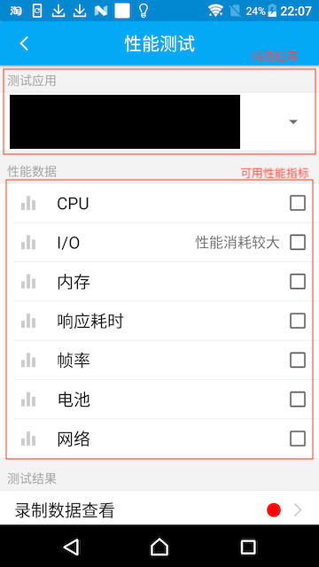

   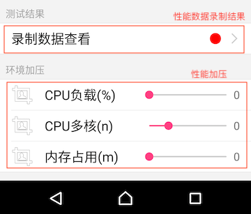

### 性能数据查看与记录

1. 勾选性能项，Soloπ会展示对应的性能指标

   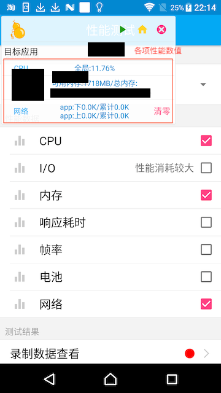

   > 在进入应用前，Soloπ会显示全局指标，进入应用后，Soloπ会显示应用最上层进程的相关性能指标。
   >
   > CPU、内存指标为进程维度，响应耗时、帧率、网络为应用维度，电池为全局指标。
   >
   > 具体性能指标描述请参考后文性能指标一段。

2. 点击悬浮窗中的应用标题，进入目标应用，切换为进程维度数据  

   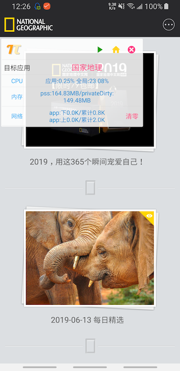

3. 点击开始按钮（绿色三角），进行性能数据录制，可进行相关操作

   

4. 结束录制，点击终止按钮（红色圆形），Soloπ会提示录制数据存放的位置，数据保存在`/sdcard/solopi/records/XXX`目录下

   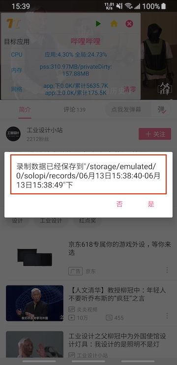

   > 录制数据为csv格式，包含三列，第一列为Unix时间戳，第二列为数据数值，第三列为额外字段

5. 点击悬浮窗右上角关闭键（红色"X"）可关闭悬浮窗，需要手动回到性能测试页面，可在录制数据查看一项中查看之前录制过的数据。

   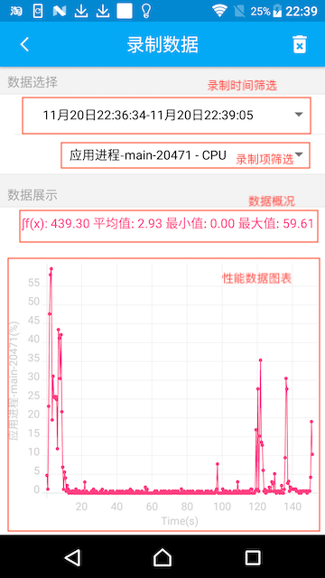

6. 在录制项筛选中，可以选择之前录制的各项数据进行观看，内存与CPU会记录在顶层出现过的进程的数据。如果发生了进程切换，会记录前后10次数据。

   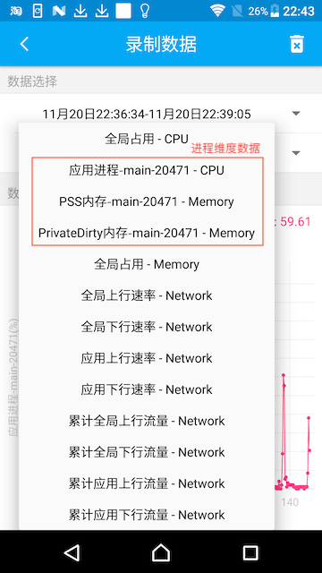

7. 当录制项过多时，可以点击右上角删除图标，对旧数据进行删除。

   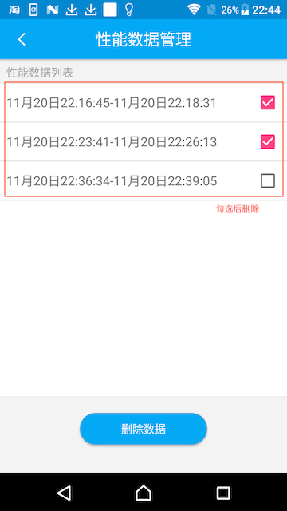

### 环境加压

Soloπ提供了环境加压的功能，可以提供CPU与内存加压

> 由于android系统的调度，CPU与内存加压均存在一定限制，当应用处于后台状态时，CPU加压占比会遭到一定程度的限制，而内存加压过大可能导致Soloπ被系统进行回收，敬请谅解。

1. 内存加压

    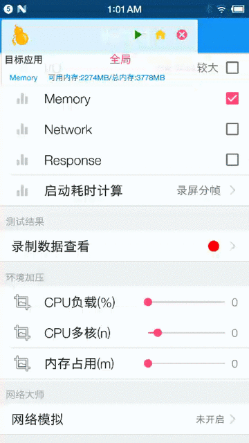

2. CPU加压

   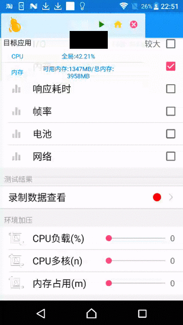

### 响应耗时计算工具

Soloπ响应耗时计算工具，通过录屏分帧的方式自动识别起始点和结束点，精确计算耗时。

#### 视频演示

<video src = "Performance/response.mp4" control="control" ></video>
[响应耗时计算](Performance/response.mp4)

#### 特性

- 模拟用户视觉，计算结果更贴近用户体验
- 自动记录点击起始点，自动识别屏幕变化结束点
- 通过OpenCV进行图像识别
- 支持原生应用、H5、游戏
- 支持启动耗时、页面跳转耗时、列表滑动耗时、动画耗时

#### 使用方法

1. 进入Soloπ性能测试页面，点击启动耗时计算。

   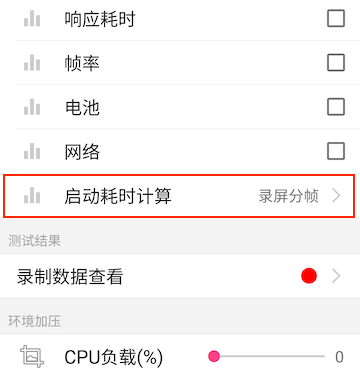

2. 建议默认参数无需修改，点击启动按钮，会弹出录制浮窗。

   

3. 切换至待测应用，并进入操作路径的起始页面。

   > 如果不需要关注细微的动画，请将二值对比差异设置为2%

   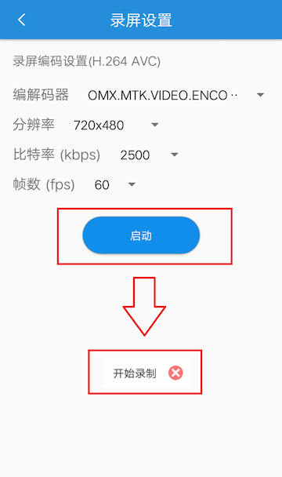

4. 点击开始录制（按钮会变为结束录制），然后在被测应用界面执行操作

   

5. 当页面停止变化后，点击结束录制。几秒后会显示测试结果。

   

## 注意事项

- 结束页存在轮播图？
  - 请在进入结果页后，在轮播图变化前点击结束录制
- 测试结果异常：过大，过小，或为负数？
  - 本次结果失效，请重新测算。结果以多次测算后稳定的结果为准。
- 结束录制后，一直阻塞在计算中？
  - 请关闭浮窗，退出Soloπ，重新打开耗时计算工具进行测算。

## Soloπ提供的各项性能指标介绍

#### CPU

   

​	包含应用顶层Activity所在进程的CPU占用百分比与全局CPU占用百分比，对于单进程应用，该数据表示该应用的CPU占用情况；对于多进程进程应用，该数据表示顶层UI进程的CPU占用情况，当发生进程切换时，Soloπ能够自动切换到新的进程数据。

#### 内存

   

​	包含应用顶层Activity所在进程的PSS(Proportional Set Size，即实际使用内存)内存、Private Dirty(私有内存)内存与全局占用内存，对于单进程应用，该数据表示该应用的内存占用情况；对于多进程进程应用，同CPU一样，Soloπ也支持自动切换顶层进程。

#### 帧率

   

​	包含应用实际帧率，延迟帧数、1秒内单帧最长延迟时间与延迟帧数占所有帧数的百分比。属于应用维度数据。目前Soloπ是根据设备gfxinfo信息计算1秒内超时帧时间，从而反推出实际帧率，所以在接近静止的情况下， 部分帧率可能显示有误。推荐在滑动或页面切换等动态场景下进行帧率测试。

#### 网络

   

​	包含应用上下行速率与累计流量以及全局上下行速率与累计流量。属于应用维度数据。点击右侧清零按钮可以清空累计数据。

#### 响应耗时

   

​	包含应用点击的响应耗时与刷新耗时数据。属于应用维度数据。从用户点击开始，到系统第一次发出界面更新时间为响应耗时，到系统停止界面刷新的时间为刷新耗时。

> 当目标页面存在动画时，可能影响响应耗时计算的准确性。

#### 电池

   

​	包含设备瞬时电流与电流均值。属于全局维度数据。点击右侧清零按钮可以清空电流累计数据。

> 部分设备存在瞬时电流更新缓慢的情况，这种情况下均值意义较小。

