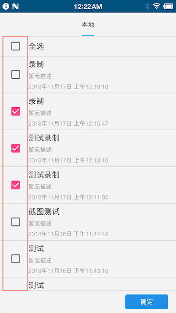

## 介绍

在Soloπ的录制模式对应用进行操作，Soloπ能够将用户的操作记录下来并保存为自动化测试用例，支持在其他设备上进行用例回放。支持重复回放、批量回放等功能。

## 视频演示

### 用例录制

<video src = "RecordCase/record.mp4" control="control" ></video>

[Record](RecordCase/Record.mp4)

### 用例回放

<video src = "RecordCase/replay.mp4" control="control" ></video>

[Replay](RecordCase/Replay.mp4)

## 准备工作

打开Soloπ，进入录制回放功能，Soloπ会申请adb、悬浮窗、后台白名单与文件读写权限，具体的准备工作请参考[初次使用](FirstUse)。

进入录制回放页面，界面如下：

## 录制回放

### 录制

通过Soloπ，对用户在设备上的操作进行录制，将操作步骤存在本地作为一条用例。

1. 点击启动按钮后，Soloπ会弹出操作悬浮窗，并自动跳转到被测应用的首页 

   > 如果Soloπ未能通过android.intent.category.LAUNCHER解析出被测应用的启动页，跳转会失败
   >
   > 按钮1表示开始按钮，按钮2为回到Soloπ应用，按钮3为隐藏Soloπ图标，点击目标应用文字（红框4）可以进入目标应用
   >
   
2. 在悬浮窗中点击开始按钮，进入录制状态 

3. 录制过程中，Soloπ会对用户的操作进行拦截，高亮当前点击的控件，并弹出操作选择框，如果显示的红框与期望操作的控件不符，可以考虑切换到H5增强模式进行查找。 
    

  > 控件操作的具体内容可以查看 [控件操作](Actions#常用控件操作方法示例)
  >
  > 当Soloπ图标为红色时，表示正在执行操作，执行完成后会变为黄色，请耐心等待

  如果通过通用模式或H5增强模式均无法查找到对应控件，可以切换到图像查找模式，通过图像匹配进行查找。

  使用图像查找模式时，Soloπ会截取当前屏幕截图，由用户选择区域进行操作。

  

4. 除了上述基于控件的操作，Soloπ还提供了处理弹窗、scheme跳转等全局操作，可以通过点击小葫芦图标唤起操作选择框： 

   > 具体操作介绍可参考[全局操作](Actions#常用全局操作方法示例)
   
5. 当录制完成后，在全局操作选择框中，选择结束。回到Soloπ录制回放页面

### 回放

1. 在Soloπ录制回放页面中，点击下方的查看全部按钮，可以查看到本地所有的用例

  

  被测应用打开后，点击开始按钮，用例就会开始进行回放

  

2. 在全部用例列表中，点击列表中任意一条case，Soloπ会打开被测应用，并进入准备回放状态。

  

  

  

3. 用例回放过程中，Soloπ会高亮待操作控件

  

4. 回访结束后，Soloπ会展示回放的相关内容
   - 回放概况

      

   - 回放用例步骤信息

      

     > 可以点击查看目标节点与实际查找节点的区别

      

   - 回放应用日志

      

      > Soloπ会从logcat中获取的目标应用所有进程的日志，所以会有一部分日志产生时间在开始回放之前

   - 用例截图

      

## 用例列表

在Soloπ录制回放页面点击“查看全部”即可进入

  

其中各条用例均可长按，长按后会显示以下四种功能

   

1. 删除用例，从数据库中删除该条用例

2. 导出用例，Soloπ会将该条用例导出到`/sdcard/solopi/export`文件夹下，用户可自行将该用例拷贝到其他设备的`/sdcard/solopi/import`文件夹内，在设置中进行导入，详见[第一次使用][firstUse]中[相关配置][relativeConfig]一节。

3. 重复播放，Soloπ会重复执行该条用例，可以配置回访次数与是否在每次用例执行前重启应用。
   
   
   
   回放完毕后，会展示批量执行结果，点击每一项，可以查看单条用例执行结果
   
   

4. 编辑用例，Soloπ支持对该条用例进行编辑，对用例中的步骤进行增、删、改操作；同时，Soloπ支持在用例中添加IF、WHILE的逻辑判断功能，详细使用方法请参考[用例编辑](CaseEdit)

## 批量回放

1. 点击右上角批量回放进入

  

2. 勾选需要回放的用例，点击确定开始回放

  

3. 用例回放完毕后，会回到批量回放结果页

  